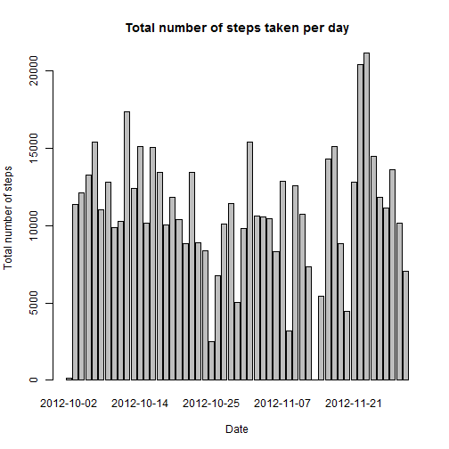
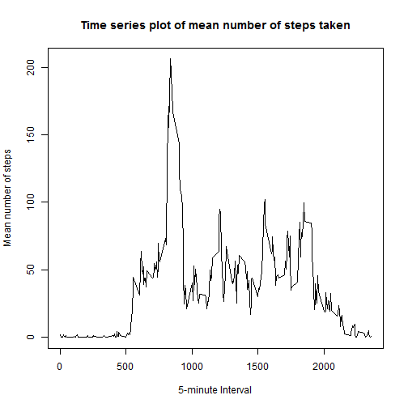
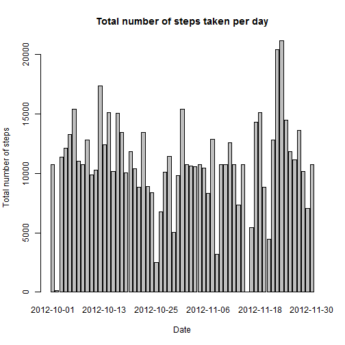

## Loading and preprocessing the data

>  1. Unzip and load the dataset 


```r
unzip("activity.zip")
activity <- read.csv("activity.csv")
```


## What is the mean total number of steps taken per day?

>  1. Histogram of the total number of steps taken each day 

- Create a data set with the total number of steps taken each day
- Create a histogram 


```r
steps_day <- aggregate(steps ~ date, data = activity, FUN = sum)

with(steps_day, {
  barplot(
        height=steps,
        main="Total number of steps taken per day", 
        ylab = "Total number of steps",
        xlab = "Date",
        names.arg=date
        )
})
```

 

>  2. Mean and median number of steps taken each day 

- To calculate the mean total number of steps


```r
mean(steps_day$steps)
```

```
## [1] 10766.19
```

- To calculate the median total number of steps

```r
median(steps_day$steps)
```

```
## [1] 10765
```


## What is the average daily activity pattern?

>  1. Create a time series plot of the mean number of steps taken in each 5-minute interval across all days 

- Create a data set with the mean number of steps taken in each 5-minute interval across all days.
- Then, create a time series plot


```r
steps_5min <- aggregate(steps ~ interval, data = activity, FUN = mean)

with(steps_5min, {
  plot(x=interval,
       y=steps,
       type="l",
       main="Time series plot of mean number of steps taken", 
       ylab = "Mean number of steps",
       xlab = "5-minute Interval",
       )
}
)
```

 

>  2. Compute which 5-minute interval contains the maximum number of steps on average across all days 


```r
intervalmax <- steps_5min[steps_5min$steps==max(steps_5min$steps),]
intervalmax
```

```
##     interval    steps
## 104      835 206.1698
```

The interval between 835 and 840 minutes has the maximum number of steps on average, at 206.1698.


## Imputing missing values
>  1. Calculate the total number of missing values in the dataset 


```r
countNA <- nrow(subset(activity, is.na(activity$steps)))
countNA
```

```
## [1] 2304
```

The total number of missing values is 2304 

>  2. Strategy to fill in missing values in the dataset 

I will use the means for the 5-minute intervals across all days to fill in the missing values in the dataset.

> 3. Create a new dataset with the missing values filled in


```r
# merge original dataset with the dataset that contains the means for the 5-minute intervals 
activity_5minmean <- merge(activity, steps_5min, by = "interval", suffixes = c("",".y"))

# mark which rows in original dataset has missing values
nas <- is.na(activity_5minmean$steps)

# replace missing values with the mean values for the 5-minute intervals
activity_5minmean$steps[nas] <- activity_5minmean$steps.y[nas]

# keep only first three columns
activity_5minmean <- activity_5minmean[, c(1:3)]

# count number of missing values in original dataset
nrow(subset(activity, is.na(activity$steps)))
```

```
## [1] 2304
```

```r
# count number of missing values in imputed dataset (for checks)
nrow(subset(activity_5minmean, is.na(activity_5minmean$steps)))
```

```
## [1] 0
```

> 4. Histogram, mean and median total number of steps taken per day


```r
# Compute total number of steps taken per day in imputed dataset
steps_day_impute <- aggregate(steps ~ date, data = activity_5minmean, FUN = sum)

# Histogram of total number of steps taken per day
with(steps_day_impute, {
  barplot(
        height=steps,
        main="Total number of steps taken per day", 
        ylab = "Total number of steps",
        xlab = "Date",
        names.arg=date
        )
})
```

 

```r
# Mean total number of steps taken per day
mean(steps_day_impute$steps)
```

```
## [1] 10766.19
```

```r
# Median total number of steps taken per day
median(steps_day_impute$steps)
```

```
## [1] 10766.19
```

The impact of the missing data seems to be small and minimal, at least when estimating the total number of steps per day.

## Are there differences in activity patterns between weekdays and weekends?

> 1. New factor variable indicating weekday or weekend


```r
daytype <- function(date) {
    if (weekdays(as.Date(date)) %in% c("Saturday", "Sunday")) {
        "weekend"
    } else {
        "weekday"
    }
}
activity_5minmean$daytype <- as.factor(sapply(activity_5minmean$date, daytype))
```

> 2. Panel plot with time series plots of average steps taken in 5-minute intervals across weekdays or weekends


```r
par(mfrow = c(2, 1))
for (type in c("weekend", "weekday")) {
    steps_type <- aggregate(steps ~ interval, data = activity_5minmean, subset = activity_5minmean$daytype == 
        type, FUN = mean)
    plot(steps_type, type = "l", main = type)
}
```

 
